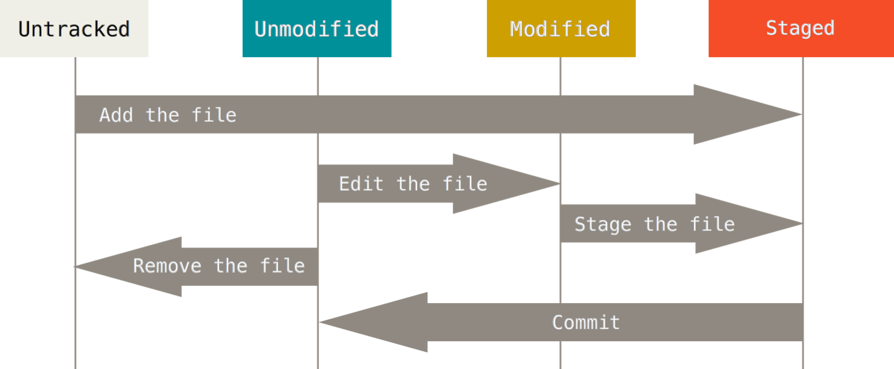
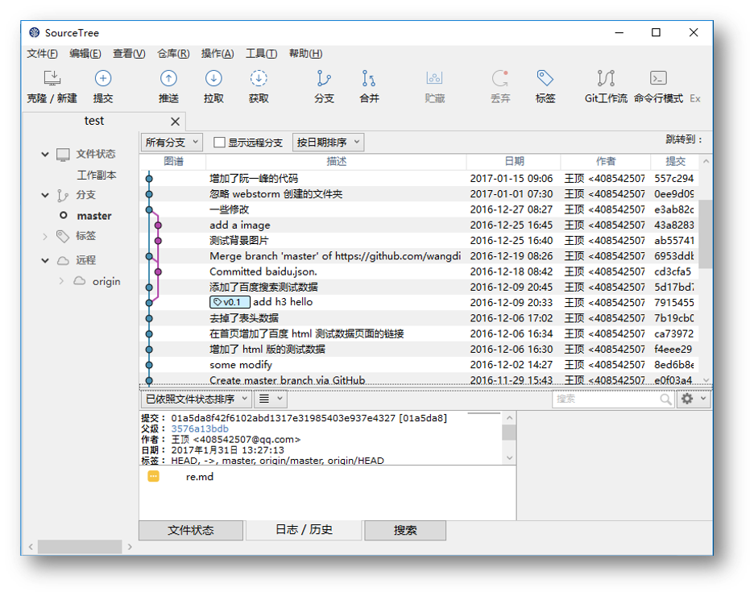

## Git命令总结

### 设置Git参数

```bash
# 显示当前的 Git 配置
git config --list

# 设置提交仓库时的用户名信息
git config --global user.name "fuziwang"

# 设置提交仓库时的邮箱信息
git config --global user.email "2622860598@qq.com"
```

### Git基础命令

**新建代码仓库**

```bash
# 在当前目录新建一个 Git 代码库
git init

# 下载一个项目和它的整个代码历史
# url 格式: https://github.com/[userName]/reposName
git clone [url]
```

**添加删除文件**

```bash
# 添加指定文件到暂存区
git add [file1] [file2]

# 删除工作区文件，并且将这次删除放入暂存区
git rm [file1] [file2]

# 改名文件，并且将这个改名放入暂存区
git mv [file-origin] [file-renamed]
```

**代码提交**

```bash
# 提交暂存区到仓库
git commit –m [message]

# 直接从工作区提交到仓库
# 前提该文件已经有仓库中的历史版本
git commit –a –m [message]
```

**查看信息**

```bash
# 显示变更信息
git status

# 显示当前分支的历史版本
git log
git log --oneline
```

**同步远程仓库**

```bash
# 增加远程仓库，并命名
git remote add [shortname] [url]

# 将本地的提交推送到远程仓库
git push [remote] [branch]

# 将远程仓库的提交拉下到本地
git pull [remote] [branch]
```

### Git 三个区域、四种状态




### Git GUI

+ 用 `Git GUI` 体验 `Git` 基本操作；
+ 百度搜索 `SourceTree` 并下载；安装并注册 `SourceTree`；用 `SourceTree` 体验 `Git` 基本操作；
+ 在 `Hbuilder` 中安装 `EGit` 插件；用 `EGit` 体验 `Git` 基本操作；



### Git 配置

+ `.gitignore`

使用场合：

1. 忽略操作系统自动生成的文件，比如：缩略图，等；
2. 忽略编译生成的中间文件、可执行文件等，比如： C 语言编译产生的 .obj 文件和 .exe 文件；
3. 忽略你自己的带有敏感信息的配置文件，比如：存放口令的配置文件；
4. tmp/ 临时目录；
5. log/ 日志目录；

```bash
# 强制添加 .gitignore 忽略的文件
git add –f <file name>

# 查看 .gitignore 策略生效行号
git check-ignore –v <file name>
```

+ **换行符**

```bash
# CR: carriage return 回车，光标到首行， ‘\r’ = return
# LF: line feed 换行，光标下移一行，’\n’ = newline
# linux: 换行 \n
# windows: 换行 \r\n
# MAC OS: 换行 \r

# 提交时转换为LF，检出时转换为CRLF，默认设置不用修改，Git 是 linux 配置
git config –-global core.autocrlf true
# 允许提交包含混合换行符的文件
git config –-global core.safecrlf false
# 在windows能看到对应的warning提示，如果不想出现提示输入下列的命令
git config –-global core.safecrlf false
```

+ **别名**

```bash
# 以图形的方式打印 Git 提交日志，该命令非常长，可以设置别名来使命令非常简练
git log –pretty=format:’%h %ad | %s%d’ –graph –date=short

# 设置别名
git config –-global alias.ci commit

# 或者编辑.gitconfig文件
vim ~/.gitconfig
[alias]
  	co = checkout
	ci = commit
	hi = log --pretty=format:'%h %ad | %s%d [%an]' --graph --date=short
	br = branch -v
	ad = add .
	st = status -sb
```

+ **凭证**

```bash
# 存储凭证，主要为了解决每次都需要输入用户名和密码的问题，建议使用ssh协议解决，此办法是通过https方式解决
git config –-global credential.helper wincred
```

