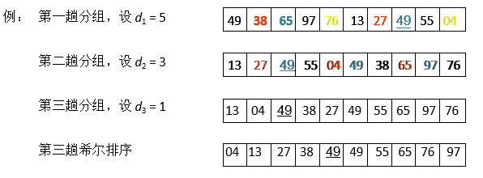
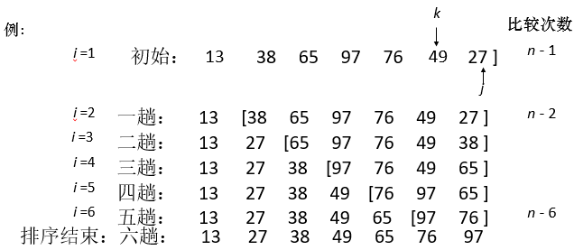
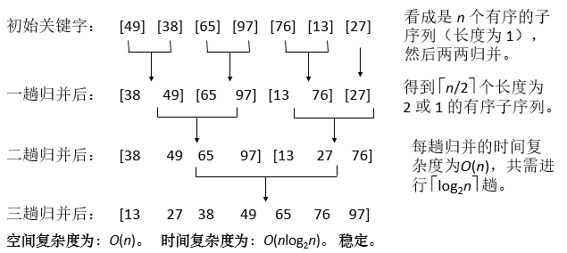
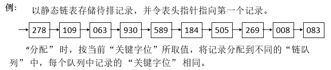
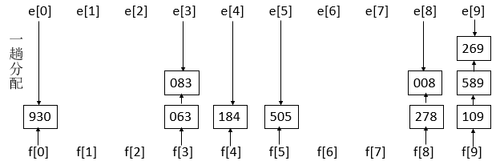
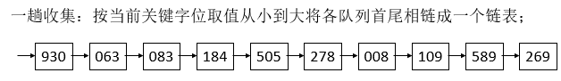
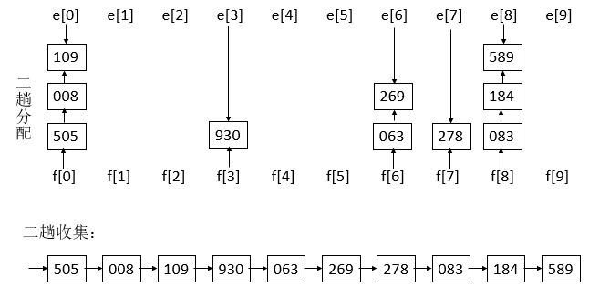
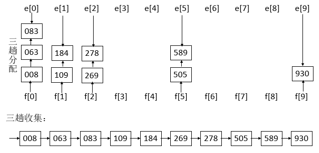

## 交换排序

### 冒泡排序

冒泡排序的原理如下，从第一个元素开始.，把当前元素和下一个索引元素进行比较。如果当前元素大，那么就交换位置，重复操作直到比较到最后一个元素，那么此时最后一个元素就是该数组中最大的数。下一轮重复以上操作，但是此时最后一个元素已经是最大数了，所以不需要再比较最后一个元素，只需要比较到 `length - 1` 的位置

+ 排序结果

```md
49 38 65 97 76 13 27 49/
38 49 65 76 13 27 49/ 97
38 49 65 13 27 49/ 76
38 49 13 27 49/ 65
38 13 27 49 49/
13 27 38 49
13 27 38
```

+ 算法实现

```javascript
function bubble(arr){
    for(let i = 0;i<arr.length;i++){
        for(let j = 0;j<arr.length-i-1;j++){
            if(arr[j]>arr[j+1]){
                let temp = arr[j];
                arr[j] = arr[j+1];
                arr[j+1] = temp;
            }
        }
    }
    return arr;
}
bubble([49,38,65,97,76,13,27]);
//[13, 27, 38, 49, 65, 76, 97]
```

+ 算法分析：起泡排序的时间复杂度约为：`O(n * n)`，空间复杂度`S(n) = O(1)` 起泡排序是稳定性排序

### 快速排序

快排的原理如下。随机选取一个数组中的值作为基准值（一般选择第一个），从左至右取值与基准值对比大小。比基准值小的放数组左边，大的放右边，对比完成后将基准值和第一个比基准值大的值交换位置。然后将数组以基准值的位置分为两部分，继续递归以上操作。

+ 排序结果

```md
49 38 65 97 76 13 27
27 38 49 97 76 13 65
27 38 13 49 76 97 65
{27 38 13} 49 {76 97 65}
{13 27 38} 49 {65 76 97}
```

+ 排序算法

```javascript
function quicksort(arr,from,to){
    let i = from,
        j = to,
        key = arr[from];
    if(from >= to){
        return;
    }
    while(i<j){
        while(arr[j]>key && i<j) j--;
        while(arr[i]<=key && i<j) i++;
        if(i<j){
            let temp = arr[i];
            arr[i] = arr[j];
            arr[j] = temp;
        }
    }
    arr[from] = arr[i];
    arr[i] = key;
    console.log(arr);
    quicksort(arr,from,i-1);
    quicksort(arr,i+1,to);
}
let arr = [49,38,65,97,76,13,27];
quicksort(arr,0,6);
console.log(arr);
```

+ 算法分析：通常，快速排序被认为是，在所有同数量积`O(nlogn)`的排序方法中，其平均性能最好。可能蜕变为冒泡排序，这样时间复杂度就是`O(n*n)`空间复杂度`O(n)~O(logn)`。它是一种不稳定的排序方法。

## 插入排序

### 直接插入排序

第一个元素默认是已排序元素，取出下一个元素和当前元素比较，如果当前元素大就交换位置。那么此时第一个元素就是当前的最小数，所以下次取出操作从第三个元素开始，向前对比，重复之前的操作

+ 排序结果

```md
49 38 65 97 76 13 27
38 49 65 97 76 13 27 第一趟
38 49 65 97 76 13 27 第二趟
38 49 65 97 76 13 27 第三趟
38 49 65 76 97 13 27 第四趟
13 38 49 65 76 97 27 第五趟
13 27 38 49 65 76 97 第六趟
```

+ 排序算法

```javascript
function insertsort(arr){
    for(let i = 1;i<arr.length;i++){
        for(let j = i-1;j>=0 && arr[j]>arr[j+1];j--){
            var temp = arr[j];
            arr[j] = arr[j+1];
            arr[j+1] = temp;
        }
    }
    return arr;
}
insertsort([49,38,65,97,76,13,27]);
```

+ 算法分析：直接插入排序的时间复杂度约为：`O(n * n)`，空间复杂度`S(n) = O(1)` 直接插入排序是稳定性排序

### 折半插入排序

+ 排序结果

```md
49 38 65 97 76 13 27
38 49 65 97 76 13 27
38 49 65 97 76 13 27
38 49 65 97 76 13 27
38 49 65 76 97 13 27
13 38 49 65 76 97 27
13 27 38 49 65 76 97
```

+ 排序算法

```javascript
function halfinsertsort(arr){
    for(let i = 1;i<arr.length;i++){
        let low = 0,
            high = i-1;
        let key = arr[i];
        while(low <= high){
            let m = parseInt((low+high)/2);
            if(key<arr[m]) high = m-1;
            else low = m+1;
        }
        for(let j = i-1;j>high;j--){
            arr[j+1] = arr[j];
        }
        arr[high+1] = key;
    }
    return arr;
}
halfinsertsort([49,38,65,97,76,13,27]);
```

+ 算法分析：折半插入排序的时间复杂度约为：`O(n * n)`，空间复杂度`S(n) = O(1)` 折半插入排序是稳定性排序

### 希尔排序

排序过程：先取一个正整数 *d*1 < *n*，把所有相隔 *d*1 的记录放在一组内，组内进行直接插入排序；然后取
*d*2 < *d*1，重复上述分组和排序操作；**直至** **di = 1**，即所有记录放进一个组中排序为止。其中
**di** **称为增量**（一般取值5 3 1）。 

+ 排序结果



+ 算法分析：希尔排序的时间复杂度约为：`O(n的1.3次方)` 空间复杂度`S(n) = O(1)`希尔排序是非稳定性排序

## 选择排序

### 简单选择排序

遍历数组，设置最小值的索引为 0，如果取出的值比当前最小值小，就替换最小值索引，遍历完成后，将第一个元素和最小值索引上的值交换。如上操作后，第一个元素就是数组中的最小值，下次遍历就可以从索引 1 开始重复上述操作

+ 排序结果



+ 排序算法

```javascript
function choosesort(arr){
    for(let i = 0;i<arr.length;i++){
        let min = i;
        for(let j = i+1;j<arr.length;j++){
            if(arr[j]<arr[min]) min = j;
        }
        var temp = arr[min];
        arr[min] = arr[i];
        arr[i] = temp;
    }
    return arr;
}
choosesort([49,38,65,97,76,13,27])
```

+ 算法分析：
  + 时间复杂度约为：`O(n*n)`，空间复杂度`S(n) = O(1)`
  + 移动次数： 正序：最小值为 `0`  最大值为 `3(n-1)` （最坏的情况需要移动n-1次，每移动一次需要进行三次交换，因此是`3*(n-1)`）
  + 最大值的情况：前 n – 1个为正序，第 n 个记录的关键字最小。 
  + 简单选择排序是一种**不稳定**的排序方式

### 堆排序

输出堆顶元素之后，以堆中最后一个元素替代之**；**然后将根结点值与左、右子树的根结点值进行比较，并与其中小者进行交换；重复上述操作，直至叶子结点，将得到新的堆，称这个从堆顶至叶子的调整过程为“筛选”。

**堆排序—建堆**

从无序序列的第 n/2（向下取整） 个元素（即无序序列对应的完全二叉树的最后一个内部结点）起，至第一个元素止，进行反复筛选。 

+ 算法分析：
  + 因此，堆排序的时间复杂度为`O(nlogn)`，与简单选择排序 `O(n*n)`  相比时间效率提高了很多。
  + 空间复杂度：`S(n) = O(1)`
  + 堆排序是一种**速度快**且**省空间**的排序方法。是一种**不稳定**的排序方式

## 归并排序

归并：将两个或两个以上的有序表组合成一个新的有序表。

在内部排序中，通常采用的是 **2-路归并排序**。即：将两个位置相邻的记录有序子序列归并为一个记录有序的序列。 



## 基数排序

+ 排序结果












+ 算法分析：
  + T(n)=O(d(n+rd))
  + 空间复杂度：S(n)=2rd 个队列指针 + n 个指针域空间
  + 基数排序是一种稳定的排序方式

## 排序总结

**排序的时间复杂度，空间复杂度，稳定性**

| 排序方法     | 时间复杂度        | 空间复杂度 | 稳定性     |
| ------------ | ----------------- | ---------- | ---------- |
| 直接插入排序 | **O（n2）**       | **O（1）** | **稳定**   |
| 折半插入排序 | **O（n2）**       | **O（1）** | **稳定**   |
| 希尔排序     | **O（n1.3）**     | **O（1）** | **不稳定** |
| 起泡排序     | **O（n2）**       | **O（1）** | **稳定**   |
| 快速排序     | **O（nlogn~n2）** | **O（1）** | **不稳定** |
| 简单选择排序 | **O（n2）**       | **O（1）** | **不稳定** |
| 堆排序       | **O（nlogn）**    | **O（1）** | **不稳定** |
| 归并排序     | **O（nlog2n）**   | **O（n）** | **稳定**   |
| 基数排序     |                   |            | **稳定**   |