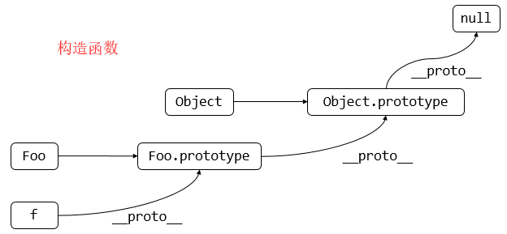

## 变量类型和计算

### 基础知识

变量类型

+ 值类型（`number`、`string`、`boolean`）

```javascript
var a = 100;
var b = a;
a = 200;
console.log(b);//100
// 值类型是存放在栈区的，每次声明一个变量，就会分配一个内存空间，存放该变量
```

+ 引用类型（对象、数组、函数）

```javascript
var a = {age:20};
var b = a;
b.age = 21;
console.log(a.age);//21
// 引用类型是存放在堆区，有指针指向该内容，由于内存空间问题，所以引用类型是用指针指向
```

`typeof`运算符

```javascript
typeof undefined //undefined
typeof 'abc' // string
typeof 123 // number
typeof true // boolean
typeof {} // object
typeof [] // object
typeof null // object
typeof console.log // function
```

变量计算

+ 字符串拼接（使用 `+` 运算符）

```javascript
var a = 100 + 10;// 110
var b = 100 + '10';// 10010
```

+ `==`运算符

```javascript
100 == '100' //true
0 == '' //true
null == undefined //true
// 可以转化为false的内容 NaN 0 false null undefined
```

+ `if`语句（`if`执行的是严格意义的三等，同`switch...case`中的`case`）

```javascript
if(...){}
```

+ 逻辑运算符

```javascript
10 && 0 // 0
'' || 'abc' // 'abc'
!window.abc // true
// 将一个变量转换为true 和 false
var a = 100;
console.log(!!a);// true
```

### 面试题目

+ `JS`中使用`typeof`能得到哪些类型？

```javascript
typeof undefined //undefined
typeof 'abc' // string
typeof 123 // number
typeof true // boolean
typeof {} // object
typeof [] // object
typeof null // object
typeof console.log // function
// typeof不能确定具体是哪一个对象
```

+ 何时使用`===` 和 `==` ？

```javascript
if(obj.a == null){
    // 这里相当于是obj.a === null || obj.a === undefined
    // 主要用途用来判断对象属性是否存在和函数的参数是否存在
}
/*
* 除了上述的情况使用 == 其余情况用 ===
* 这是因为jQuery源码中推荐这么使用
*/
```

+ `JS`中有哪些内置函数？

```javascript
Object
Array
Boolean
Number
String
Function
Date
RegExp
Error
```

+ `JS`变量按照存储方式分为哪些类型，并描述其特点？

```javascript
// 值类型和引用类型
// 值类型是存放在栈区的，每次声明一个变量，就会分配一个内存空间，存放该变量
// 引用类型是存放在堆区，有指针指向该内容，由于内存空间问题，所以引用类型是用指针指向
```

+ 如何理解`JSON`？

```javascript
// 1. JSON是一个js的对象
JSON.stringify({age:23});// 对象转化为字符串
JSON.parse('{age:23}');// 字符串转化为对象
// 2. JSON是一种数据传输格式
```

## 原型和原型链

### 基础知识

构造函数

```javascript
function Foo(name,age){
    this.name = name;
    this.age = age;
    this.class = 'class-1';
    // return this;// 默认有这一行
}
var f = new Foo('zhangsan',20);
var f1 = new Foo('lisi',21);
// new在执行过程中会先将this变为空对象，然后执行Foo函数，返回this对象
```

+ 扩展补充

```javascript
var a = {}; // 等价于 var a = new Object();
var a = []; // 等价于 var a = new Array();
function Foo(){} // 等价于 var Foo = new Function();
// 我们一般使用instanceof来判断一个函数是否是一个变量的构造函数
f instanceof Foo
```

原型规则

+ 所有的引用类型（数组、对象、函数）都具有对象特性，即可自由扩展属性（就是可以添加属性）
+ 所有的引用类型（数组、对象、函数）都有一个`__proto__`属性，属性值是一个普通对象
+ 所有的函数都有`prototype`属性，属性值也是一个普通对象
+ 所有的引用类型（数组、对象、函数）的`__proto__`属性值指向它的构造函数的`prototype`属性值
+ 当试图得到一个对象的某个属性时，如果这个对象本身没有这个属性，那么会在它的`__proto__`（即它的构造函数的`prototype`）寻找

```javascript
var obj = {}; obj.a = 100;
var arr = []; arr.a = 100;
function fn(){}
fn.a = 100;

console.log(obj.__proto__);
console.log(arr.__proto__);
console.log(fn.__proto__);

console.log(fn.prototype);// 函数具有prototype属性

console.log(obj.__proto__ === Object.prototype);// true

// 详细理解第5条

// 构造函数
function Foo(name,age){
    this.name = name;
}
Foo.prototype.alertName = function(){
    alert(this.name);
}
// 创建实例
var f = new Foo('zhangsan');
f.printName = function(){
    console.log(this.name);// this永远指向调用的对象
}
// 测试
f.printName();
f.alertName();

// 循环对象自身的属性，不包括原型链上的
var item;
for(item in f){
    // 高级浏览器已经for in 中屏蔽了来自原型的属性
    // 但是这里建议大家还是加上这个判断，提高浏览器的健壮性
    if(f.hasOwnProperty(item)){
        console.log(item);
    }
}
```

原型链



```javascript
// 构造函数
function Foo(name,age){
    this.name = name;
}
Foo.prototype.alertName = function(){
    alert(this.name);
}
// 创建实例
var f = new Foo('zhangsan');
f.printName = function(){
    console.log(this.name);// this永远指向调用的对象
}
// 测试
f.printName();
f.alertName();
f.toString();// 要去 f.__proto__.__proto__ 中进行查找
```

instanceof

+ 用于判断引用类型属于哪个构造函数的方法

```javascript
f instanceof Foo
// 判断逻辑：f的__proto__一层一层往上，能够找到Foo.prototype
f instanceof Object
// 判断逻辑：f的__proto__一层一层往上，能够找到Object.prototype
```

### 面试题目

+ 如何判断一个变量是数组类型

```javascript
var arr = [];
arr instanceof Array // true
typeof arr // object, typeof是无法判断是否是数组的
```

+ 写一个原型链继承的例子

课本上的例子（面试时不使用）

```javascript
// 动物
function Animal(){
    this.eat = function(){
        console.log('animal eat');
    }
}
// 狗
function Dog(){
    this.bark = function(){
        console.log('dog dark');
    }
}
Dog.prototype = new Animal();
/*
代表Dog.prototype是一个对象，拥有eat属性，也相当于Dog.prototype.__proto__ = Animal.prototype
*/
// 哈士奇
var hashiqi = new Dog();

// 面试过程中不能这么写，要会写一个更加贴近实战的例子
```

封装DOM查询

```javascript
function Elem(id){
    this.elem = document.querySelector(id);
}

Elem.prototype.html = function(val){
    var elem = this.elem;
    if(val){
        elem.innerHTML = val;
        return this; // 链式操作
    } else {
        return elem.innerHTML;
    }
}

Elem.prototype.on = function(type,fn){
	var elem = this.elem;
    elem.addEventListener(type,fn);
    return this;
}

var div1 = new Elem('#div1');
// console.log(div1.html());
div1.html('<p>hello immoc</p>');
div1.on('click',function(){
    alert('clicked');
});
// 链式操作
div1.html('<p>hello immoc</p>').on('click',function(){
    alert('clicked');
})；
```

+ 描述 `new` 一个对象的过程

```javascript
/*
* 创建一个新的对象
* this指向这个对象（this刚开始指向一个空的对象）
* 执行代码，即对this赋值
* 返回this
*/
function Foo(name,age){
    this.name = name;
    this.age = age;
    this.class = 'class-1';
    // return this;// 默认有这一行
}
var f = new Foo('zhangsan',20);
var f1 = new Foo('lisi',21);
// new在执行过程中会先将this变为空对象，然后执行Foo函数，返回this对象
```

+ `zepto`（或其他框架）源码中如何使用原型链

参考教程：[zepto设计和源码分析](http://www.imooc.com/learn/745)